<!-- MATRIX RAIN HEADER -->

---

<!-- IDENTITY CARD SVG -->

---

<!-- STATUS + SKILLS side by side -->
&nbsp;&nbsp;

---

<!-- LIVE CLOCK + DATE + REGION WIDGET -->

---

<!-- CODING ACTIVITY / WAKATIME WIDGET -->

---

<!-- DEV JOKE -->

---

<!-- EXISTENTIAL CRISIS TERMINAL -->

---

### 🎞️ Currently Loading...

 

&nbsp;&nbsp;&nbsp;&nbsp;

---

### 📊 GitHub Activity

 

  

  

<!-- CONTRIBUTION SNAKE -->
<picture>
  <source media="(prefers-color-scheme: dark)" srcset="https://raw.githubusercontent.com/Kaelith69/Kaelith69/output/github-contribution-grid-snake-dark.svg">
  <source media="(prefers-color-scheme: light)" srcset="https://raw.githubusercontent.com/Kaelith69/Kaelith69/output/github-contribution-grid-snake.svg">
  
</picture>

---

<!-- VISITOR BADGE -->

  

<!-- FOOTER QUOTE SVG -->

