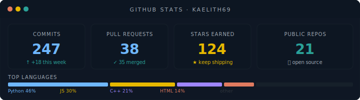

<div align="center">

```text
  k a e l i t h 6 9
  ─────────────────
  cs student. malabar.
  developer & digital artist.
  probably debugging something rn.
```

</div>

---

<div align="center">


</div>

---

<div align="center">

 &nbsp;&nbsp;&nbsp; 

</div>

---

<div align="center">

```text
the specs:
  → mother tongue: malayalam (മലയാളം)
  → tech stack: html, css, js, photoshop, procreate
  → main quest: pass the turing test
  → aesthetic: clean code & cell-shaded art
```

```text
things i do:
  → write code that works (once, briefly)
  → start procreate sketches (cell-shaded, obviously)
  → find a philosophical quote for literally any situation
  → contemplate the turing test
  → lose to dad jokes. every time.
```

```text
                ┌──────────────────────────────────┐
                │  Dad: "I'm afraid for the        │
                │  calendar. Its days are           │
                │  numbered."                       │
                │                                  │
                │  me: ...                         │
                │                      [stunned]   │
                └──────────────────────────────────┘
```

</div>

---

<div align="center">

### 🎞️ Currently Loading...

<br>

 &nbsp;&nbsp;&nbsp;&nbsp;&nbsp;&nbsp; 

<br><br>

</div>

---

<div align="center">

### 📊 GitHub Activity

<br>

<a href="https://github.com/kaelith69">
  
</a>

<br><br>

<a href="https://github.com/kaelith69">
  
</a>

<br><br>

<picture>
  <source media="(prefers-color-scheme: dark)" srcset="https://raw.githubusercontent.com/kaelith69/kaelith69/output/github-contribution-grid-snake-dark.svg">
  <source media="(prefers-color-scheme: light)" srcset="https://raw.githubusercontent.com/kaelith69/kaelith69/output/github-contribution-grid-snake.svg">
  
</picture>

</div>

---

<div align="center">

> *"Everything that lives is designed to end."*
> — NieR: Automata
>
> *( my bugs didn't get the memo )*

</div>
