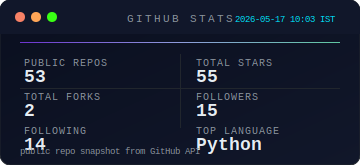
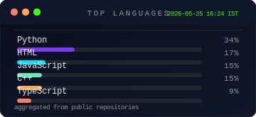

<!-- markdownlint-disable MD033 MD045 MD041 MD040 -->


<br/>

<div align="center">

[](https://github.com/Kaelith69)

</div>

<br/>

---

<br/>

<div align="center">

<table border="0" cellspacing="0" cellpadding="0">
<tr>
<td align="center" width="50%" valign="top">

**`> whoami`**

```yaml
name:      Kaelith69
base:      Kerala, India  🌴
timezone:  IST — UTC +5:30
mood:      [ coding + gaming ]
anime:     perpetually watching
energy:    lo-fi + late nights
```

</td>
<td width="4%"></td>
<td align="center" width="46%" valign="top">

**`> runtime.config`**

```yaml
status:    shipping things
learning:  always something new
reading:   docs (when forced)
playing:   whatever hits rn
listening: lo-fi  /  OSTs
uptime:    23:59  daily
```

</td>
</tr>
</table>

</div>

<br/>

---

<br/>

<div align="center">

### `// stack`

<br/>

[](https://github.com/Kaelith69)

</div>

<br/>

---

<br/>

<div align="center">

### `// stats`

<br/>


&nbsp;&nbsp;


<br/><br/>

[](https://github.com/Kaelith69)

</div>

<br/>

---

<br/>

<div align="center">

### `// activity`

<br/>

[](https://github.com/Kaelith69)

<br/>

<picture>
  <source media="(prefers-color-scheme: dark)"  srcset="https://raw.githubusercontent.com/Kaelith69/Kaelith69/output/github-contribution-grid-snake-dark.svg">
  <source media="(prefers-color-scheme: light)" srcset="https://raw.githubusercontent.com/Kaelith69/Kaelith69/output/github-contribution-grid-snake.svg">
  
</picture>

<sub>Snake animation is published from the output branch and refreshes automatically.</sub>

</div>

<br/>

---

<br/>

<div align="center">

### `// highlights`

<br/>


<br/>

This profile is kept in sync by the repository workflow and the generated widgets under the project root.

</div>

<br/>

---

<br/>

<div align="center">

[](https://github.com/Kaelith69)

</div>

<br/>

---

<br/>


<div align="center">

<br/>


</div>
